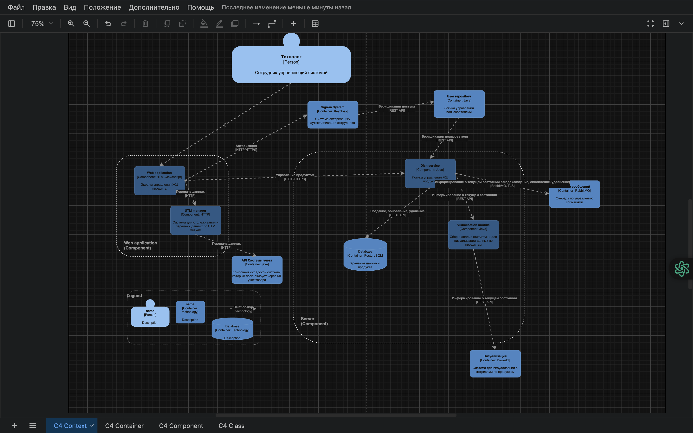

= ТЗ на разработку микросервиса _product-catalog-ms_

.История изменений
|===
|Версия документа|Версия микросервиса|Дата|Описание|Релиз изменения|Версия контракта|Задачи в Jira|Автор

|1.0|1.0.0|2025-06-08|Начальная версия ТЗ|1.0.0|1.0.0|PROD-001|Иванов И.И.
|===

== Общие сведения
.Общие сведения о микросервисе
[cols="1a,1a", options="header"]
|===
|Параметр |Описание
|Техническое название сервиса	| product-catalog-ms
|Назначение сервиса	| Микросервис предназначен для автоматизированного заведения, хранения и актуализации информации о новых продуктах в сети закусочных "Замысловатость".
|Используется системами	| ERP, Система заказов, Сайт/Мобильное приложение, Интеграция с CRM, Система аналитики
|Использует системы	| Хранилище MasterData, ERP, Уведомления, Каталог ингредиентов
|Протокол передачи данных	| HTTPS (REST API)
|Тип сервиса	| Микросервис (Stateless)
|Кодировка	| UTF-8
|Статус	| 
* [x] В разработке
* [ ] На среде TEST
* [ ] На среде PREPROD
* [ ] На среде PROD
* [ ] Не используется
|===

== Контракт 
link:api/product.yaml[product.yaml]

== Архитектура работы сервиса

== Детальное описание методов сервиса

=== createProduct +
*Название метода*: createProduct +
*Путь метода*: /api/products +
*Тип взаимодействия*: синхронный +
*Тип операции*: POST +
*Тип входящего сообщения*: http запрос, Content-Type: application/json +
*Тип исходящего сообщения*: http ответ, Content-Type: application/json +
*Влияние на группы продуктов*: да +
*Описание очередей MQ*: поддерживается отправка событий product.created +
*Бизнес-объект*: Product +

==== Краткое описание метода

Метод предназначен для создания нового продукта в системе. Принимает параметры нового продукта, выполняет валидацию, записывает в БД и инициирует события для интеграций (ERP, каталог, уведомления).

==== Диаграмма работы метода
link:diagrams/sequence-createProduct.puml[Диаграмма последовательности метода createProduct]

==== Алгоритм работы метода
. *Формирование и отправка запроса*
.. Потребитель (например, сотрудник отдела технологов) формирует запрос c параметрами нового продукта.
.. Сервис выполняет валидацию параметров запроса (уникальность, обязательные поля, корректность состава и цены).
... Если валидация неуспешна — сервис возвращает http 400 с описанием ошибки.

. *Обработка результата операции*
.. При успешной проверке сервис сохраняет продукт в БД.
.. Генерируется событие product.created для очереди (MQ) и отправляются уведомления интегрированным системам.
.. В ответе возвращается ID созданного продукта и краткая информация о нём.

=== updateProduct +
*Название метода*: updateProduct +
*Путь метода*: /api/products/{id} +
*Тип взаимодействия*: синхронный +
*Тип операции*: PATCH +
*Тип входящего сообщения*: http запрос, Content-Type: application/json +
*Тип исходящего сообщения*: http ответ, Content-Type: application/json +
*Влияние на группы продуктов*: да +
*Описание очередей MQ*: поддерживается product.updated +
*Бизнес-объект*: Product +

==== Краткое описание метода
Изменение свойств ранее заведённого продукта.

=== getProductById +
*Название метода*: getProductById +
*Путь метода*: /api/products/{id} +
*Тип взаимодействия*: синхронный +
*Тип операции*: GET +
*Тип входящего сообщения*: http запрос +
*Тип исходящего сообщения*: http ответ +
*Влияние на группы продуктов*: нет +
*Описание очередей MQ*: нет +
*Бизнес-объект*: Product +

==== Краткое описание метода
Получение информации о продукте по идентификатору.

== Нефункциональные требования

=== Протоколирование работы
. Все действия микросервиса логируются с уровнем INFO, ошибки — с уровнем ERROR.
. Логирование интегрировано в централизованную систему мониторинга (например, ELK).

=== Производительность
|===
|Параметр	|Значение

|Максимальное количество запросов в день	| 10 000
|Пиковая нагрузка| 30 запросов в секунду
|Максимальное время отклика	| 800 мс
|===

=== Доступность
. Время доступности: 24x7*365

=== Класс восстановления
|===
|Класс критичности	|Класс восстановления |RTO |RPO

| 2 (Средний) | 2 | 4 часа | 30 минут
|===

=== Политики обеспечения безопасности и целостности
- Аутентификация пользователей через корпоративную IAM-систему (OAuth2)
- Все входящие и исходящие запросы проходят через шифрованное соединение (TLS 1.2+)
- Валидация и журналирование всех изменений

=== Аутентификация и авторизация
- Для всех методов используется OAuth2, роли: admin, technologist, integrator

=== Защищаемые объекты
- Данные о продуктах
- Интеграционные события

.Размещение: во внутреннем защищённом контуре

