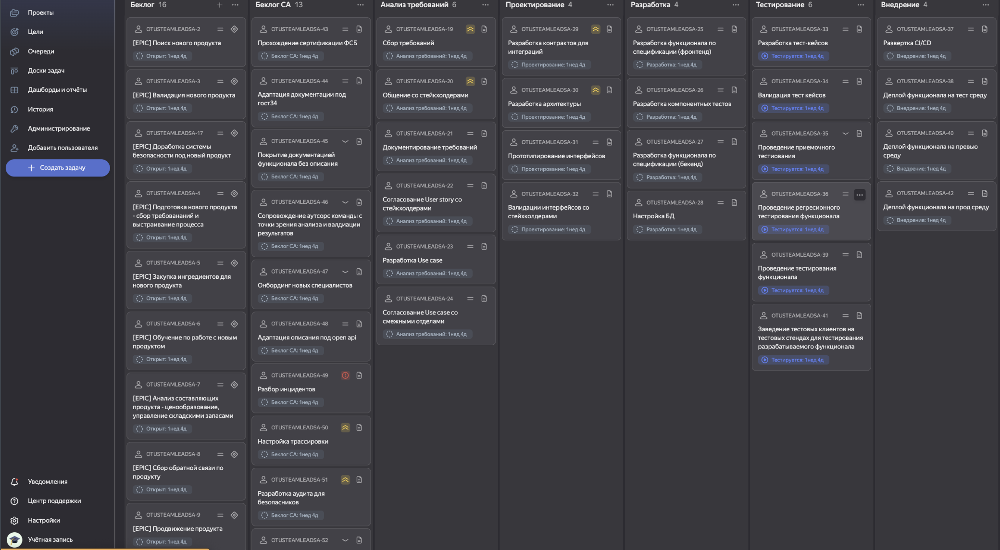
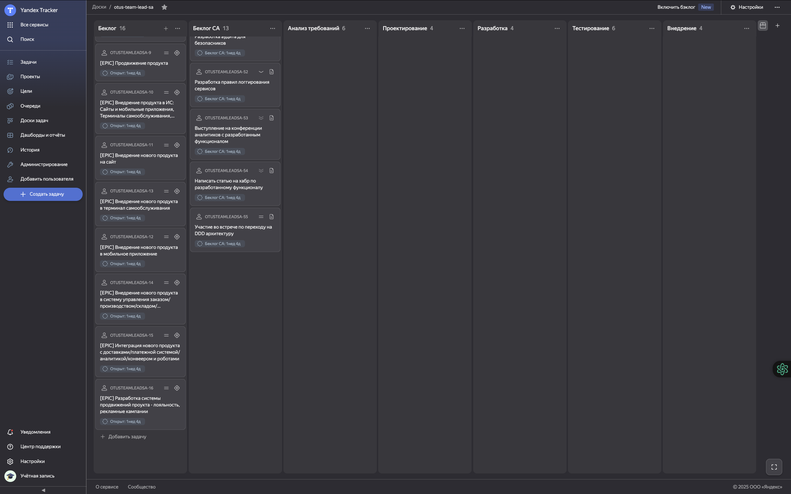
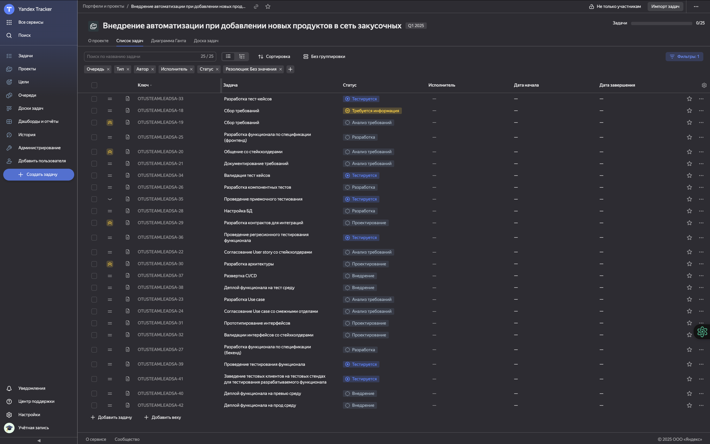
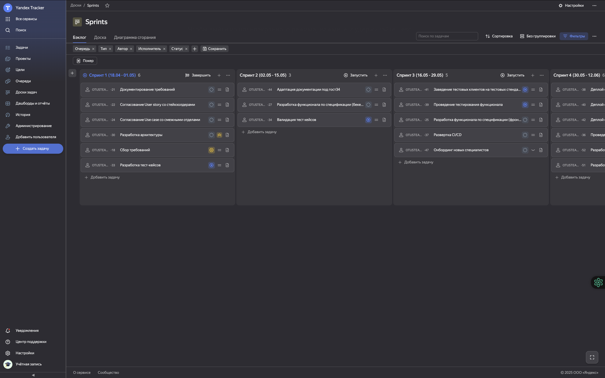
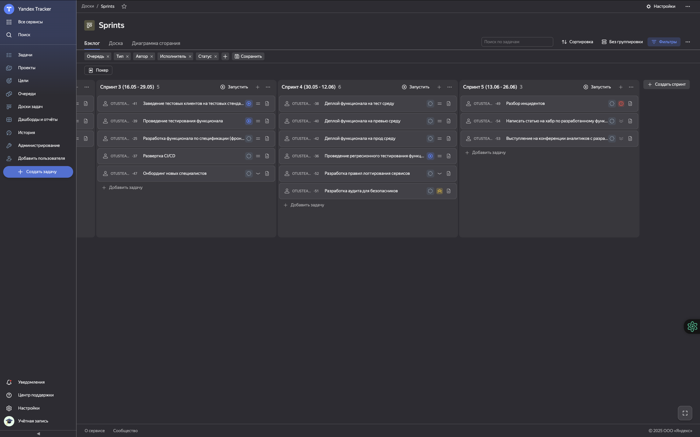
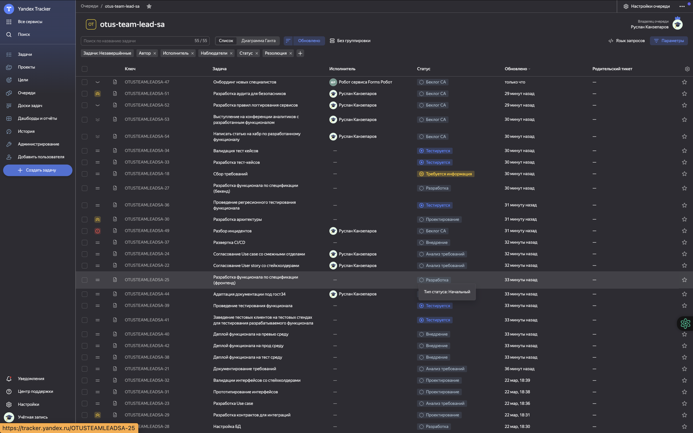
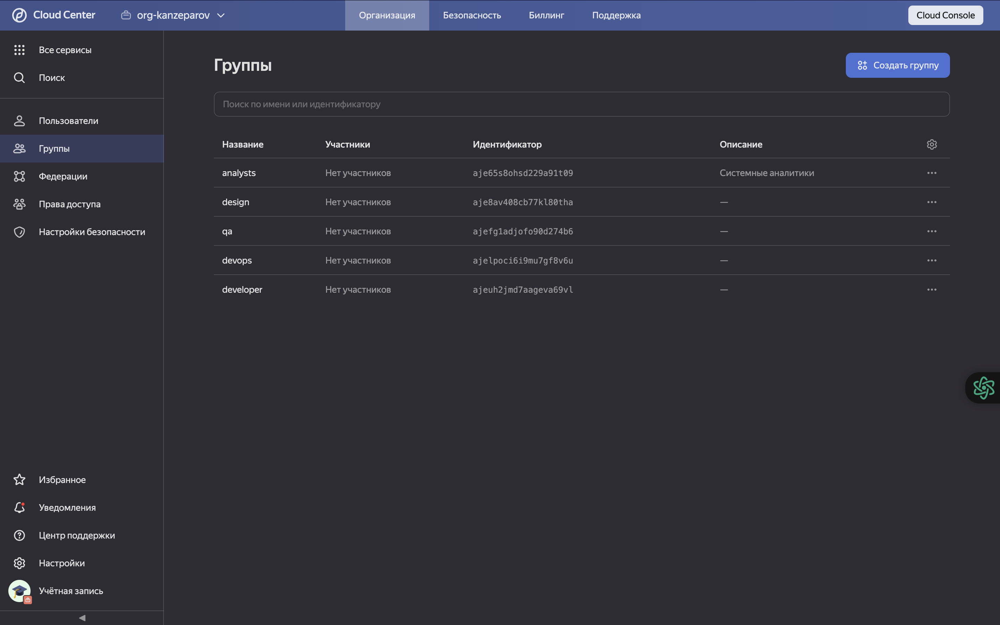
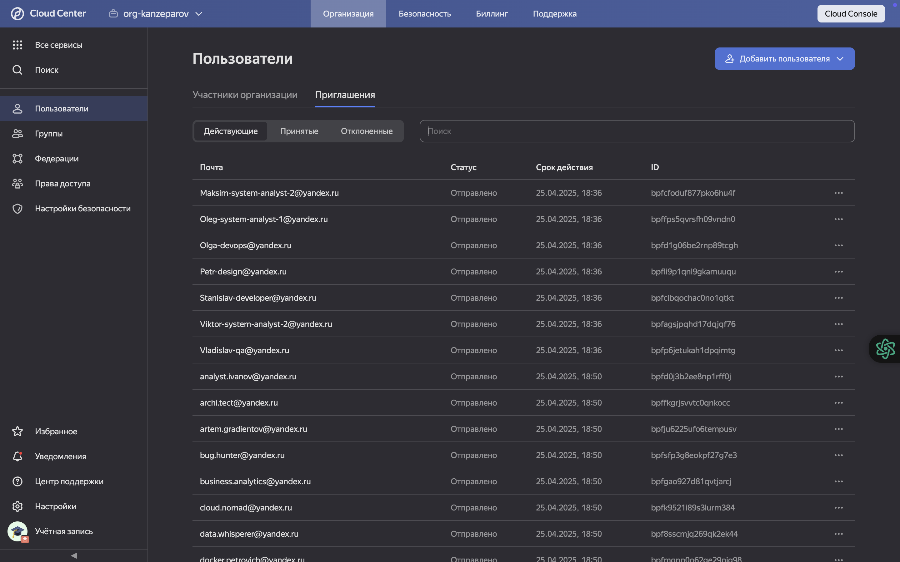
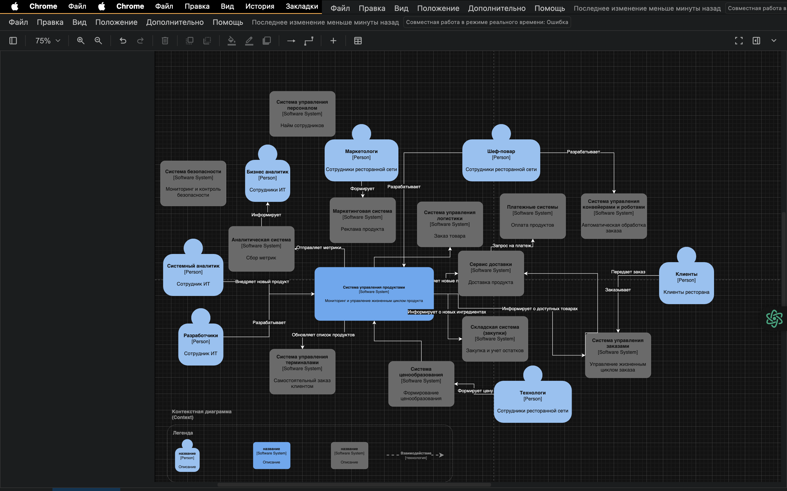

= Проект по разработке сервиса автоматизированного сбора требований
:toc:
:sectnums:

== Общая информация

Сеть закусочных "Замысловатость" активно расширяет ассортимент блюд и внедряет инновационные сервисы. Необходима централизованная система для управления внедрением новых продуктов.

== Цели проекта

. Повысить скорость вывода новых продуктов на рынок
. Обеспечить прозрачность и контроль этапов внедрения
. Упростить тестирование и аналитику по новым инициативам
. Интегрировать с ERP, заказом, CRM
. Соответствовать стандартам ИБ

== Подход к автоматизации и выбор методологии

В описании задачи говорится: _«Ключевой задачей в рамках выполнения данной проектной работы является реализация механизмов упрощенного внедрения новых продуктов в сети межконтинентальных закусочных “Замысловатость”. Внедрение требует более 1 месяца, за это время конкуренты успевают внедрить по 6–7 новых продуктов, и артефакты их диалогов и результатов работы постоянно теряются.»_

Наша задача — реализовать механизм, позволяющий запускать новый продукт максимально быстро, чтобы получить конкурентное преимущество среди клиентов.

Ключевое решение:

* Использование гибких методологий для быстрой разработки работоспособной версии.
* Использование базы знаний (Confluence/Notion) и системы таск-трекинга (Jira) для сбора и визуализации процессов и задач.

=== Для разработки проекта

- Используется agile (scrum):
  * Scope задач согласуется со стейкхолдерами на старте, что позволяет планировать спринты максимально ровно.
  * За счет ограничения scope можно гибко управлять процессом и избежать неожиданных "влетов".
  * Предварительный анализ и оценка задач — гарантия предсказуемости сроков.
  * Итерационная работа: по завершению каждого спринта демонстрируется инкремент и собирается обратная связь от стейкхолдеров.

- Основные scrum-практики:
  * Планирование беклога со стейкхолдерами — 2 раза в квартал (выбор приоритетных задач для ближайших спринтов).
  * Планирование спринта с командой — в начале спринта (уточнение задач на ближайшие 2 недели).
  * Грумминг задач — в середине спринта (подготовка задач из беклога для будущих спринтов).
  * Дейли-митинги — ежедневно (мониторинг прогресса, снятие блокеров).
  * Спринт-ревью — в конце спринта (демонстрация инкремента, обсуждение с заказчиком).
  * Ретроспектива — в конце спринта (разбор проблем, создание action plan по улучшениям).
  * Длительность спринта: 1 месяц.

=== Для внедрения проекта

- Используется agile (kanban):
  * Внедрение связано с появлением неожиданных задач и "влетов", поэтому нужен непрерывный поток задач.
  * Поток задач — непредсказуемый, требует высокой гибкости.
  * Задачи по сути повторяют логику ранее реализованных, но могут быть разными по масштабу.

- Основные kanban-практики:
  * Планирование беклога со стейкхолдерами (обзор стратегии) — раз в квартал.
  * Планирование задач с командой (пополнение задач) — раз в неделю.
  * Дейли-митинги — ежедневно (мониторинг прогресса, снятие блокеров).
  * Ревью продукта (обзор предоставления услуг) — раз в месяц (демонстрация стейкхолдерам работоспособного прототипа, сбор обратной связи).
  * Ретроспектива (обзор операций) — раз в месяц (анализ проблем и улучшений).

=== Спринты и встречи

- Планирование беклога со стейкхолдерами: 2 раза в квартал
- Планирование спринта с командой: в начале спринта
- Грумминг задач: середина спринта
- Дейли: ежедневно
- Спринт-ревью: в конце спринта
- Ретроспектива: в конце спринта

== Основные задачи (Epic, декомпозиция)

. Разработка цифровой платформы сбора идей и требований
. Система аналитики по новым продуктам (продажи, отклики)
. Интеграция с ERP, складом, бухгалтерией
. Поддержка масштабируемости и отказоустойчивости
. Обеспечение безопасности (RBAC, OAuth2, логирование)
. Документирование процесса (docs-as-code / Confluence)
. Подготовка MVP, создание задач в Jira, диаграмма Ганта

== Оценка ресурсов

* Использована Agile оценка (story points/man-days)
* Ресурсы на команду (пример): 3 системных аналитика (Senior/Middle/Junior)
* Спринт 1: сбор требований и анализ — 2 недели
* Спринт 2: дизайн архитектуры и интеграций — 2 недели
* Спринт 3: разработка прототипа — 2 недели
* Спринт 4: интеграция с ИТ-системами — 2 недели
* Спринт 5: тестирование и внедрение — 2 недели
* Всего: MVP за 2,5 месяца

== Декомпозиция задач и визуализация (Jira, Trello, Task Tracker)

К сожалению, проект удалился из Яндекс.Трекера, остались только скриншоты. Был опрос по данной ситуации в группе.

=== Декомпозиция задач

*Общий бэклог всех задач:*

*Декомпозиция задач системного анализа:*

*Эпики проекта:*

*Подробное распределение задач на первые спринты:*

*Дополнительные задачи в беклоге:*

=== Группы и аккаунты

*Группы для разных отделов на проекте:*

*Заведённые аккаунты сотрудников:*

=== Диаграмма Ганта

*Подробная диаграмма Ганта по задачам системной аналитики:*
image:../images/roadmap.png[Диаграмма Ганта]

=== MVP

Презентация MVP проекта:  
link:https://docs.google.com/presentation/d/1SSWKq_Yl_OA1AKX8uzsW40ehhUd_AAoBrgdzZjdqj78/edit?usp=sharing[Ссылка на Google Slides]

---

== Риски проекта

В данном разделе представлены основные риски, связанные с реализацией и внедрением проекта автоматизации внедрения новых продуктов в сети “Замысловатость”.

=== Риски организации/предприятия в целом

* Банкротство компании — *Низкая*
* Санкции на пищевую отрасль — *Низкая*
* Пандемия — *Средняя*
* Забастовка сотрудников — *Низкая*
* Война — *Средняя*
* Отсутствие кадров — *Средняя*

=== Риски ИТ-проекта

* Выход за пределы бюджета — *Средняя*
* Упрощение скоупа проекта из-за быстрой работы и переоценки — *Низкая*
* Смена приоритетов компании — *Низкая*
* Утечка данных — *Средняя*
* Отзыв лицензии на ИТ-продукты — *Средняя*

=== Риски отдела системной аналитики

* Уход ключевых специалистов — *Средняя*
* Неверно выявленные требования — *Высокая*
* Отсутствие компетентных специалистов на рынке — *Средняя*

_Для работы с рисками оцениваются только риски с вероятностью наступления "средняя" и выше._

=== Детализированная таблица рисков

[cols="2,2,2,1,3,2",options="header"]
|===
|Источник |Барьер |Риск |Вероятность |Мера восстановления |Последствия

| | |Банкротство компании |Низкая | | 
| | |Санкции на пищевую отрасль |Низкая | | 
|Пандемия |Переориентация на онлайн инструменты |Отсутствие спроса на продукт из сан.-эпид. ситуации |Средняя |Закладывание гибкости при разворачивании на другом рынке |Заморозка проекта
| | |Забастовка сотрудников |Низкая | | 
| | |Война |Низкая | | 
|Низкое количество компетентных сотрудников |Создание пула стажёров |Отсутствие кадров |Средняя |Увеличение сроков разработки |Затягивание процесса разработки
|Низкий бюджет |Отслеживание и оптимизация трат |Выход за пределы бюджета |Средняя |Увеличение бюджета |Остановка проекта
| | |Смена приоритетов компании |Низкая | | 
| | |Упрощение скоупа проекта из-за быстрой работы и переоценки |Низкая | | 
|Санкции |Переезд в другие юрисдикции |Отзыв лицензии на ИТ-продукты |Средняя |Использование open-source решений |Затягивание процесса разработки
|Сотрудники |Качественное документирование проекта |Уход ключевых специалистов |Средняя |Увеличение бюджета |Затягивание процесса разработки
|Некомпетентность |Перепроверка требований для ключевых мест |Неверно выявленные требования |Высокая |Сокращение функционала продукта |Переделка проекта
|===

=== Подход к управлению рисками

* _Мониторинг рисков:_ регулярное чтение релевантных статей аналитиком (10% времени)
* _Идентификация новых рисков и переоценка:_ встречи раз в квартал по оценке рисков и брейншторму
* _Коммуникация и отчетность:_ постановка задач в беклог по рискам и контроль их исполнения
* _Обучение и совершенствование:_ курсы по работе с барьерами и контрмерами

---

== Архитектурное решение

Система управления продуктами (_Product Management System_) реализована как [Software system] и обеспечивает мониторинг и управление жизненным циклом продукта.

Функциональность системы:
- Внедрение новых продуктов
- Управление жизненным циклом продуктов (создание, обновление, деактивация)
- Взаимодействие со внешними/внутренними системами (ERP, заказы, склад, BI) на всех этапах

.Диаграмма контейнеров (архитектура)
image::../images/component.avif[Компонентная схема, width=700]
link:https://app.diagrams.net/#G1vPpz48Hjr0fUFfEuE4AdBsSxpuMVIAf-#%7B%22pageId%22%3A%22zNMGI6wU0Mi8Qe2H5Q59%22%7D[Ссылка на draw.io]

На диаграмме показано, что "Система управления продуктами" взаимодействует со следующими системами:
- Система ценообразования — для расчёта и обновления цены
- Сервис доставки — для публикации новых позиций
- Аналитическая система — для передачи метрик о продажах и спросе
- Складская система (закупки) — для контроля остатков
- Система управления терминалами — для отображения новых позиций в интерфейсах

ИТ-департамент использует систему для внедрения новых продуктов, анализа и сбора статистики.
"Сервис доставки" интегрирован с платежными системами, позволяя клиенту заказывать новый продукт прямо через внешние сервисы.

Взаимодействие технолога с мобильным и веб-приложением:
- Технолог может создавать, редактировать и удалять продукты через UI.
- Веб/мобильное приложение общается с сервером по HTTPS.
- Сервер соединяется с базой PostgreSQL по TCP.
- Сервер интегрирован с системой ценообразования через брокер сообщений (RabbitMQ).
- Также реализовано взаимодействие со складской системой, BI, системой терминалов.

.Диаграмма контекстов (архитектура)

link:https://app.diagrams.net/#G1YIO_JzwDrkun-iFeaTOC8ZrdtvSyakcw#%7B%22pageId%22%3A%22zNMGI6wU0Mi8Qe2H5Q59%22%7D[Ссылка на draw.io]

В этом варианте:
- Веб-приложение использует UTM manager для передачи данных о продуктах в систему учёта товаров.
- Сервер обеспечивает авторизацию пользователей через Keycloak.
- Обмен данными с BI, складом, терминалами — аналогично.

=== ATAM-сессия для проекта по внедрению нового продукта

.Группы и роли заинтересованных лиц:
* Ведущий (системный аналитик): подготовка, анализ, тестирование, отчёты, валидация НФТ
* Продукт-менеджер: бюджетирование, приоритезация НФТ, исследование и тестирование
* Архитектор: анализ, тестирование, валидация НФТ
* Бизнес-аналитик: перевод бизнес-ожиданий в измеримые НФТ
* Технолог, маркетолог, исследователь: тестирование, бюджетирование, приоритезация

.Примеры вопросов ATAM-сессии:

[cols="2a,1a,1a", options="header"]
|===
|Вопрос |Атрибут |Этап

|Сколько активных пользователей в пике? |производительность |Исследование и анализ
|На сколько заказов должна масштабироваться система за 1–2 года? |масштабируемость |Исследование и анализ
|Какие языки UI нужны? |локализуемость |Исследование и анализ
|Кто участвует в тестировании? |надёжность |Тестирование
|Форма инструкции для эксплуатации |удобство сопровождения |Составление отчётов
|Какие сценарии самые ресурсоёмкие? |производительность |Исследование и анализ
|Как изменится система при росте числа заказов/точек? |масштабируемость |Исследование и анализ
|Предусмотрены ли пентесты, сканирование уязвимостей? |безопасность |Тестирование
|===

.Качественные атрибуты и взаимосвязи:

[cols="2a,2a", options="header"]
|===
|Качественный атрибут |Влияние

|Повышение производительности |Надёжность системы, отказоустойчивость
|Масштабируемость |Безопасность, гибкость развития
|Локализуемость |Удобство использования (может уменьшаться)
|Увеличение удобства сопровождения |Надёжность системы
|Увеличение безопасности |Удобство сопровождения
|===

=== Ключевые НФТ (нефункциональные требования)

- Система должна выдерживать до 5000 одновременных запросов (часовой пик)
- Время отклика API не более 1.5 сек (обычно), до 2 сек (в пике)
- BI-интерфейс должен обрабатывать отчёты до 100 000 записей
- Аутентификация по ролям для сотрудников, клиентов, поставщиков
- Журналирование всех действий, защита логов от изменений
- Периодическая проверка уязвимостей, обновления компонентов
- Кроссплатформенность (Web, терминалы Windows 10+, мобильные iOS/Android 10+)
- Интеграция с облаками (AWS, Яндекс, VK Cloud)
- Доступность — не менее 99.9% в месяц, self-healing, резервирование БД, ежедневные бэкапы (30 дней)
- Горизонтальное масштабирование, разделение блоков на микросервисы
- Независимое масштабирование очередей заказов, логистики, аналитики
- Использование избыточных компонентов (кластеризация, резервные каналы)
- Проверка доступности — не реже 1 раза в минуту
- Критичные модули размещены в разных зонах

=== Сертификаты и стандарты
- Соответствие ISO/IEC 27001 (информационная безопасность)

== Ключевые группы, вовлечённые в реализацию учёта НФТ

[cols="1,3",options="header"]
|===
|Группа |Роль в учёте НФТ

|Архитекторы |Актуализация архитектурных представлений, моделей и контрактов между модулями
|Бизнес-аналитики |Перевод бизнес-ожиданий в измеримые НФТ
|DevOps-инженеры |Внедрение инструментов мониторинга, логирования, тестирования производительности
|Системные аналитики |Формализация требований, контроль внедрения и валидации
|Команда тестирования |Разработка и запуск тестов по нагрузке, отказам и безопасности
|Продукт-менеджеры |Приоритезация и включение НФТ в Roadmap продукта
|===

== Ключевые артефакты, подлежащие изменению

[cols="1,3",options="header"]
|===
|Артефакт |Как необходимо изменить / расширить

|Реестр требований (backlog) |Добавить отдельный блок с категорией «НФТ» и описанием целей, метрик и проверок
|Архитектурная документация |Зафиксировать требования к производительности, безопасности, масштабируемости на уровне схем и спецификаций
|Модели угроз |Обновить в соответствии с новыми сценариями (например, при масштабировании по регионам)
|CI/CD pipeline |Включить автоматические проверки НФТ (нагрузочное тестирование, сканирование уязвимостей)
|Тест-планы |Добавить секции с тестами на надёжность, отказоустойчивость, производительность
|Метрики и SLA-документы |Уточнить количественные показатели (время отклика, доступность, масштабируемость)
|===

== Схемы архитектуры, которые нужно обновить

[cols="1,3",options="header"]
|===
|Схема |Что изменить / добавить

|Функциональная архитектура |Добавить модули логирования, мониторинга, защиты API
|Инфраструктурная схема |Уточнить зоны доступности, резервные каналы, балансировщики
|Информационные потоки |Зафиксировать каналы передачи чувствительных данных, контроль доступа
|DevOps/CI-CD архитектура |Внедрить автоматизацию тестов и проверок НФТ
|Безопасностная модель |Расширить модель угроз, описать меры защиты и восстановления
|===

== Примеры конкретных изменений на основе ATAM-сессии

[cols="2,2",options="header"]
|===
|Проблема / риск (из ATAM) |Рекомендация (изменение)

|Неопределённость по нагрузке при запуске в новой стране |Добавить модуль предиктивной аналитики трафика и автоскейлинг
|Отсутствие единой политики логирования |Внедрить централизованный сбор логов с категоризацией по сервисам
|Нет контроля за временем отклика в вечерний пик |Ввести SLA и дашборды мониторинга производительности
|Ограниченная отказоустойчивость касс |Добавить локальное кэширование заказов и отложенную синхронизацию
|===

== Рекомендации по рефакторингу

. Аудит текущих интеграций и API (стандартизация)
. Выделение единого слоя работы с требованиями
. Вынести бизнес-логику сбора требований в отдельный сервис
. Ввести тест-контуры и песочницу для проверки доработок
. Документировать бизнес-процессы в виде схем (BPMN/C4)

== Рекомендации по внедрению Doc-as-Code

. Внедрить единый репозиторий для проектной документации
. Использовать CI/CD для проверки/деплоя docs
. Назначить ответственных за актуальность документации
. Обучить команду работе с Markdown/AsciiDoc и генераторами Swagger
. Вести changelog/историю изменений по документации

---

== Итоговая презентация

link:https://docs.google.com/presentation/d/1hh4JrkIUIAPpeVN2l8Mfo-71hrAaJSurFMnfydomJ0E/edit?usp=sharing[Ссылка на Google Slides]

:end:

